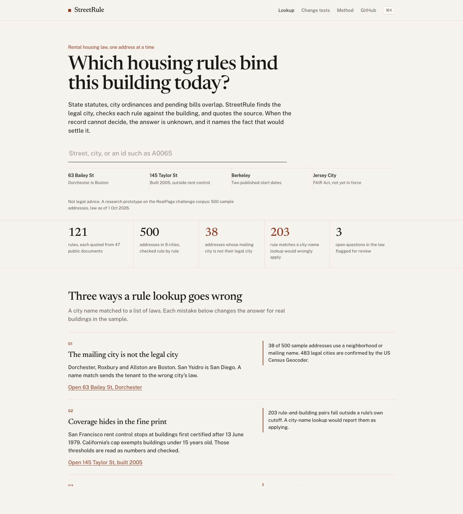
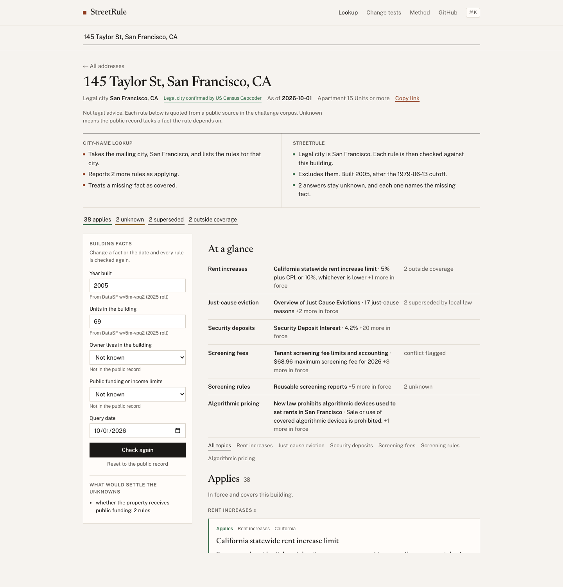
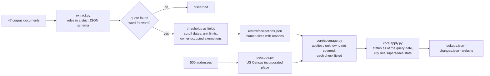
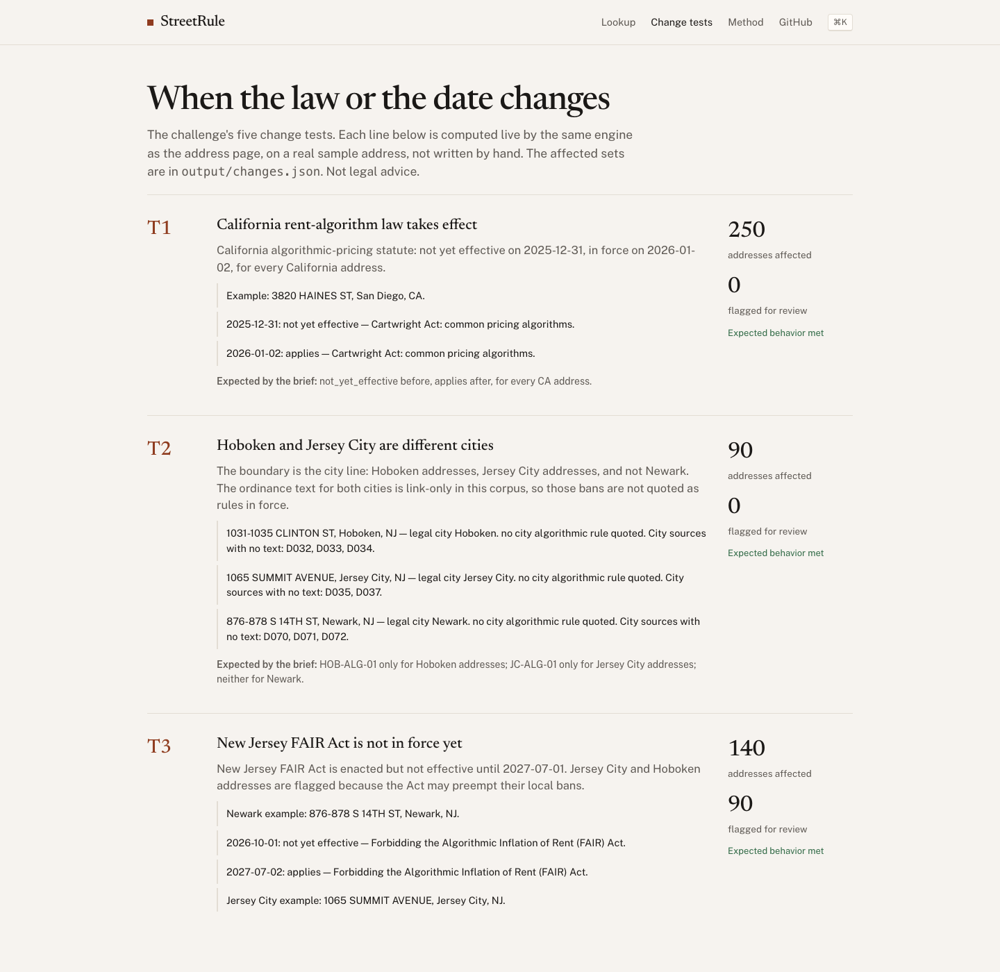

# StreetRule

**Which housing rules bind this building today?** Type an address. StreetRule finds the building's legal city, checks every state and city rule against the building's facts, and quotes the law for each answer. When the public record cannot decide, it says *unknown* and names the fact that would settle it.

Live: **https://streetrule.vercel.app** · Built for the RealPage "Rental Housing Law Navigator" challenge, Hack-Nation 2026. Not legal advice.



## The problem

A property manager with buildings in nine cities has to know, per building, which rent caps, just-cause rules, deposit limits, screening-fee caps and algorithmic-pricing bans apply. Most lookups match the mailing city to a list of laws. On the 500 sample addresses that goes wrong in three ways:

| Mistake | In the sample | What StreetRule does |
|---|---|---|
| The mailing city is not the legal city (Dorchester is Boston, San Ysidro is San Diego) | 38 of 500 addresses | Asks the US Census Geocoder for the incorporated place; 483 confirmed, a match to a different house number is rejected |
| Coverage hides in the fine print (San Francisco rent control stops at buildings certified after 13 June 1979; California's cap exempts buildings under 15 years old) | 203 rule-and-building pairs a city-name lookup reports as applying | Extracts each rule's thresholds as numbers and checks them; the failing check is shown |
| A bill is not a law, and dates disagree (NJ FAIR Act starts 2027; MA bills have not passed; Berkeley's ban has two published dates) | 6 rules pending or not yet in force on 1 Oct 2026 | Kept separate, never counted as law; conflicting dates are flagged |

## Unknown is a to-do list

A blank year-built field should not become "rent control applies". StreetRule returns *unknown* and ranks the missing facts across the portfolio by how many answers each would settle:

| Missing fact | Answers it would settle | Addresses |
|---|---|---|
| Whether the owner lives in the building | 1,061 | 243 |
| Unit count | 865 | 242 |
| Year built | 864 | 206 |
| Public funding or income limits | 660 | 310 |

Every address opens with the city-name lookup beside StreetRule's decision. Press ⌘K (Ctrl K on Windows) to jump to another address. Enter a missing fact and press *Check again*: every rule is re-decided, and the URL keeps the scenario. Change the year built of 145 Taylor St, San Francisco from 2005 to 1975 and the city's 1.6% rent-control limit applies, while California's statewide cap turns to *superseded by local law*.



## How it works

The model reads; arithmetic decides. A language model turns legal text into fields. Every decision about an address is deterministic code with tests.



1. **Extract.** `extract.py` sends each document to the model with a strict JSON schema. A rule survives only if its quote appears verbatim in the source.
2. **Thresholds.** A second pass converts coverage text into fields: `built_on_or_before`, `cutoff_uses_certificate`, `exempt_if_newer_than_years`, `min_units`, `exempt_owner_occupied_max_units`, `exempt_single_family_or_condo`, `requires_public_funding`. A city's rent-increase rules inherit the cutoff stated once on another page of the same city, and record which rule it came from.
3. **Review.** Five human corrections live in `review/corrections.json`, each with a reason and, for thresholds, a quote checked against its source. Example: San Francisco's 1979 certificate-of-occupancy cutoff is in D079, not in the rent-increase notice D080.
4. **Locate.** `geocode.py` resolves each address with the US Census Geocoder. The 17 it cannot match fall back to neighborhood aliases or the city on the record, and the page says which method was used.
5. **Decide.** `core/coverage.py` checks each threshold against the building's facts. A cutoff year is *unknown* rather than a guess when the law counts from the certificate date and the record only has a year. `core/apply.py` then applies the query date: pending, not yet effective, in force, superseded.

## Change tests

The five change tests from the brief run live on the [change tests page](https://streetrule.vercel.app/changes), each on a real sample address, with the expected behavior from the brief beside the computed result. All five meet it.



## Outputs

| File | What it is |
|---|---|
| `output/rules.json` | 121 rules from 47 public documents, each quote checked against its source |
| `output/lookups.json` | A result for all 500 sample addresses as of 2026-10-01, with the checks behind each |
| `output/changes.json` | Change tests T1–T5: the addresses each legal change affects |

The [method page](https://streetrule.vercel.app/method) has the baseline comparison and the limits.

## Tests

`uv run pytest -q` runs 16 tests. They check that every quote is in its source, every jurisdiction matches the manifest, statuses agree with effective dates, an adopted ordinance is never pending, an unsigned draft is never in force, a certificate-based cutoff stays unknown, a supplied fact settles an unknown, Cambridge is not mismatched to Boston, and all five change tests match the brief.

## Limits, stated on purpose

- Hoboken, parts of Jersey City, Newark, and the struck Massachusetts rent-cap ballot question are links with no text in the corpus. Those addresses list the sources instead of an invented rule.
- San Diego's algorithmic ordinance in the corpus is an unsigned draft, so it stays pending.
- Owner occupancy and public funding are not in the public address file. They stay unknown until someone supplies them.
- Owner names are not used.

## Run

```bash
cp .env.example .env          # put OPENAI_API_KEY in .env
uv sync
uv run python extract.py      # rules, thresholds, corrections
uv run python geocode.py      # legal city for each address
uv run python -c "from core.apply import write_outputs; write_outputs()"
uv run pytest -q
uv run uvicorn app:app --reload
```

Open http://localhost:8000. A new ordinance can be added without re-reading the corpus:

```bash
uv run python ingest_one.py incoming/t6.txt --jurisdiction "Cambridge, MA" --url URL
```

The law text, the address list and the rule format come from the RealPage starter pack supplied for this challenge.
